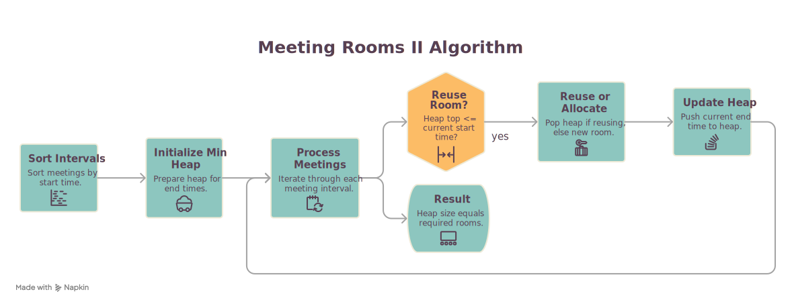
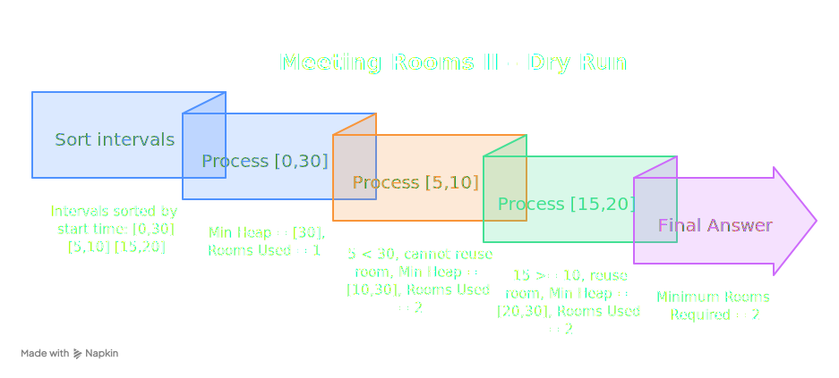
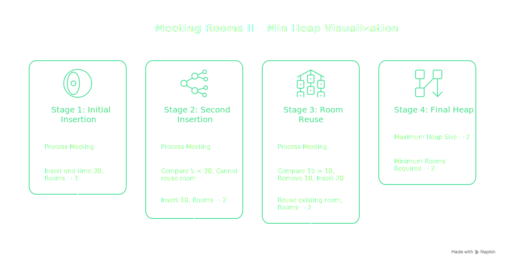
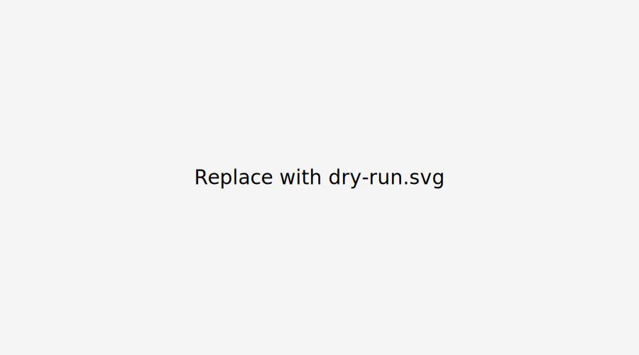

# 📊 Live Class Monitoring Dashboard: Track Learner Submissions & Status

> [!IMPORTANT]
> **Note to Instructor**
>
> - Please unlock all assignment problems prior to starting the session.
> - Keep the Metabase live tracking query open in a separate tab throughout the **600-minute** block to monitor real-time problem-solving progress.

---

# 📌 Agenda & Session Overview

| ⏱️ Duration | 🎯 Problem Title | 💡 Core Technique / Pattern |
|------------|------------------|-----------------------------|
| 60 mins | Problem 1: Meeting Rooms II | Min-Heap / Priority Queue |
| 20 mins | Problem 2: Sort a Nearly Sorted Array | Sliding Min-Heap (K+1 Window) |
| 20 mins | Problem 3: Minimum Distance Equal Pair | Last-Seen Index (Hash Map) |
| 20 mins | Problem 4: Minimum Window Substring | Dynamic Two-Pointer Sliding Window |

---

# 🏢 Problem 1: Meeting Rooms II

## 📄 Problem Statement

Given an array of meeting time intervals where each interval is `[start, end]` (`start < end`), determine the **minimum number of conference rooms** required to host all meetings without overlaps.
## 🖼️ Problem Illustration

<p align="center">
  
</p>
---
## 🎥 Animation

<p align="center">
  
</p>

---
## 🔄 Flowchart

<p align="center">
  
</p>

---
## 📊 Dry Run

<p align="center">
  
</p>

---
## 💡 Heap Visualization

<p align="center">
  
</p>

---

### Example 1

**Input**

```text
intervals = [[0,30],[5,10],[15,20]]
```

**Output**

```text
2
```

**Explanation**

- Room 1 holds `[0,30]`
- `[5,10]` overlaps with `[0,30]`, requiring Room 2.
- `[15,20]` starts after `[5,10]` ends, so it reuses Room 2.

### Example 2

**Input**

```text
intervals = [[7,10],[2,4]]
```

**Output**

```text
1
```

**Explanation**

The first meeting ends at `4`, and the second starts at `7`.

No overlap → **1 room**

> [!TIP]
> **⏱️ Learner Exercise (5 mins)**
>
> Ask students to manually track which meeting room becomes available first.

---

## 🐢 Approach 1: Brute Force

### Idea

- Sort intervals by starting time.
- Compare every meeting with all previous meetings.
- Count the maximum simultaneous overlaps.

### Complexity

| Time | Space |
|------|-------|
| **O(N²)** | **O(1)** |

---

## ⚡ Approach 2: Min-Heap (Optimal)

> [!NOTE]
> **⏱️ Discussion & Coding (10 mins)**
>
> Explain how a Min-Heap always keeps the earliest ending meeting at the top.

### Execution Logic

1. Sort meetings according to start time.
2. Create a Min-Heap storing meeting end times.
3. For every meeting:
   - If the earliest ending meeting has finished (`heap.peek() <= current.start`), remove it.
   - Insert the current meeting's ending time.
4. Heap size represents active rooms.
5. Maximum heap size is the answer.

---

## 💡 Pseudocode

```python
function minMeetingRooms(intervals):

    if intervals is empty:
        return 0

    sort(intervals by start time)

    heap = MinHeap()

    for interval in intervals:

        if heap is not empty AND heap.peek() <= interval.start:
            heap.pop()

        heap.push(interval.end)

    return heap.size()
```

---

## 📊 Complexity Analysis

| Time | Space |
|------|-------|
| **O(N log N)** | **O(N)** |

---

# 🔢 Problem 2: Sort a Nearly Sorted (K-Sorted) Array

## 📄 Problem Statement

Given a nearly sorted array where every element is at most **K positions away** from its correct sorted position, sort the array efficiently.
## 🖼️ Illustration

<p align="center">

</p>

---
## 🎥 Heap Animation

<p align="center">

</p>

---
## 🔄 Flowchart

<p align="center">

</p>

---
## 📊 Dry Run

<p align="center">

</p>

<p align="center">

</p>

---

### Example

**Input**

```text
arr = [13,22,31,45,11,20,48,60,50]
k = 4
```

**Output**

```text
[11,13,20,22,31,45,48,50,60]
```

---

> [!TIP]
> **⏱️ Learner Exercise (5 mins)**
>
> Ask:
>
> *If an element can move only K positions, where can the smallest remaining element possibly be?*

---

## 💡 Core Insight

Since every element is displaced by at most **K positions**, the smallest element for any index must lie inside a window of **K+1 elements**.

### Algorithm

1. Insert first **K+1** elements into a Min-Heap.
2. Remove minimum and place into answer.
3. Insert next array element.
4. Repeat until the array ends.
5. Remove remaining heap elements.

---

## 💡 Pseudocode

```python
function sortNearlySorted(arr, k):

    n = length(arr)

    heap = MinHeap()

    answer = []

    for i in range(0, min(k,n-1)):
        heap.push(arr[i])

    idx = 0

    for i in range(k+1, n):

        answer[idx] = heap.pop()
        idx += 1

        heap.push(arr[i])

    while heap is not empty:

        answer[idx] = heap.pop()
        idx += 1

    return answer
```

---

## 📊 Complexity Analysis

| Approach | Time | Space |
|-----------|------|-------|
| Standard Sorting | **O(N log N)** | O(1) / O(N) |
| Min-Heap | **O(N log K)** | **O(K)** |

---

# 🎯 Problem 3: Minimum Distance Between Equal Pairs

## 📄 Problem Statement

Given an array `A`, find the minimum distance between any two equal elements.

If no duplicate exists, return **-1**.

---
## 🖼️ HashMap Illustration

<p align="center">

</p>

---

## 🎥 HashMap Animation

<p align="center">

</p>

---
## 🔄 Flowchart

<p align="center">

</p>

---

### Example

**Input**

```text
A = [7,1,3,4,1,7]
```

**Output**

```text
3
```

**Explanation**

```
1 occurs at indices 1 and 4
Distance = 3

7 occurs at indices 0 and 5
Distance = 5

Minimum = 3
```

---
## 📊 Dry Run

<p align="center">

</p>

<p align="center">

</p>

---

## ⚙️ Approach Comparison

```text
Brute Force : O(N²)
↓

HashMap (Last Seen Index): O(N)
```

> [!NOTE]
> **⏱️ Discussion (10 mins)**
>
> Explain why storing only the **latest occurrence** of each value is sufficient.

---

## 📊 Dry Run

| Index | Value | HashMap | Distance | Minimum |
|-------|-------|----------|----------|----------|
| 0 | 7 | {7:0} | - | ∞ |
| 1 | 1 | {7:0,1:1} | - | ∞ |
| 2 | 3 | {7:0,1:1,3:2} | - | ∞ |
| 3 | 4 | {7:0,1:1,3:2,4:3} | - | ∞ |
| 4 | 1 | {7:0,1:4,3:2,4:3} | 3 | 3 |
| 5 | 7 | {7:5,1:4,3:2,4:3} | 5 | 3 |

---

## 💡 Pseudocode

```python
function findMinDistance(A):

    lastSeen = HashMap()

    answer = infinity

    for i from 0 to length(A)-1:

        if A[i] exists in lastSeen:

            answer = min(answer, i - lastSeen[A[i]])

        lastSeen[A[i]] = i

    if answer == infinity:
        return -1

    return answer
```

---

## 📊 Complexity Analysis

| Time | Space |
|------|-------|
| **O(N)** | **O(N)** |

---

# 🪟 Problem 4: Minimum Window Substring

## 📄 Problem Statement

Given strings `s` and `t`, return the **minimum window substring** of `s` containing every character of `t` (including duplicates).

Return `""` if no valid window exists.

---
## 🖼️ Sliding Window Illustration

<p align="center">

</p>

---
## 🎥 Sliding Window Animation

<p align="center">

</p>

---
## 🔄 Flowchart

<p align="center">

</p>

---
### Example

**Input**

```text
s = "ADOBECODEBANC"

t = "ABC"
```

**Output**

```text
"BANC"
```

---
## 📊 Dry Run

<p align="center">

</p>

<p align="center">

</p>

---


## 💡 Sliding Window Strategy

> [!NOTE]
> **⏱️ Discussion & Coding (15 mins)**
>
> Demonstrate how the window expands until valid, then shrinks to become minimum.

### Steps

1. Build frequency map of `t`.
2. Expand the right pointer.
3. When window becomes valid:
   - Update answer.
   - Move left pointer while still valid.
4. Continue until the end.

---

## 💡 Pseudocode

```python
function minWindow(s, t):

    if len(t) > len(s):
        return ""

    targetCount = frequency map of t

    windowCount = empty map

    required = number of unique characters

    formed = 0

    left = 0

    minLength = infinity

    minLeft = 0

    for right from 0 to len(s)-1:

        character = s[right]

        windowCount[character] += 1

        if character exists in targetCount AND
           windowCount[character] == targetCount[character]:

            formed += 1

        while formed == required:

            if current window smaller:

                update minimum answer

            leftCharacter = s[left]

            windowCount[leftCharacter] -= 1

            if leftCharacter exists in targetCount AND
               windowCount[leftCharacter] < targetCount[leftCharacter]:

                formed -= 1

            left += 1

    if minLength == infinity:
        return ""

    return substring(s, minLeft, minLength)
```

---

## 📊 Complexity Analysis

| Time | Space |
|------|-------|
| **O(M + N)** | **O(M + N)** |

Where:

- **M = length of s**
- **N = length of t**

Every character is visited at most twice (once while expanding and once while shrinking the window).

---

# 🎯 Summary

| Problem | Pattern | Time | Space |
|----------|----------|------|-------|
| Meeting Rooms II | Min-Heap | O(N log N) | O(N) |
| Sort Nearly Sorted Array | Min-Heap (K+1) | O(N log K) | O(K) |
| Minimum Distance Equal Pair | HashMap (Last Seen Index) | O(N) | O(N) |
| Minimum Window Substring | Sliding Window + HashMap | O(M+N) | O(M+N) |
