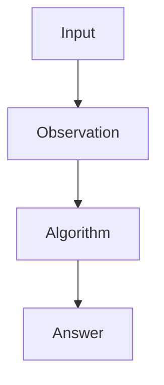

# 🚀 Minimum Window Substring

> **Difficulty:** 🟡 Medium  
> **Pattern:** Sliding Window

---

## 📌 Problem Statement

_Write the statement here._

<p align="center">

</p>

---

## 🎯 Real World Analogy

...

---

## 💡 Key Observation

> The insight behind the optimized solution.

---

## ❌ Brute Force

### Idea

### Complexity

| Time | Space |
|------|-------|
| O() | O() |

---

## ⚡ Optimized Approach



<p align="center">

</p>

---

## 🧠 Dry Run

| Step | State |
|------|-------|
|1|...|

---

## 📝 Pseudocode

```text
function solve():
    ...
```

---

## 💻 Java

```java
// Add Java solution here
```

---

## ⚡ Complexity

| Operation | Complexity |
|-----------|------------|
| Time | O() |
| Space | O() |

---

## 🎯 Interview Tips

- Pattern
- Common mistakes

---

## 📚 Similar Problems

- ...
